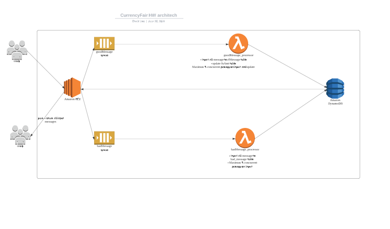

The program is build by node JS and runs on AWS service, the backend is run in EC2 server.

goodMessage_processor and badMessage_processor are lambda functions, it will spawn at most 5 tasks to prevent overloading the DB.

API: endpoint for send Message 
  http://ec2-18-188-218-222.us-east-2.compute.amazonaws.com:30000/api/sendMessage
  Sample post: {"userId": "134256", "currencyFrom": "EUR", "currencyTo": "GBP", "amountSell": 1000, "amountBuy": 747.10, "rate": 0.7471, "timePlaced" : "24-JAN-15 10:27:44", "originatingCountry" : "FR"}
  
  endpoint for get all message :
  http://ec2-18-188-218-222.us-east-2.compute.amazonaws.com:30000/api/scan
  

